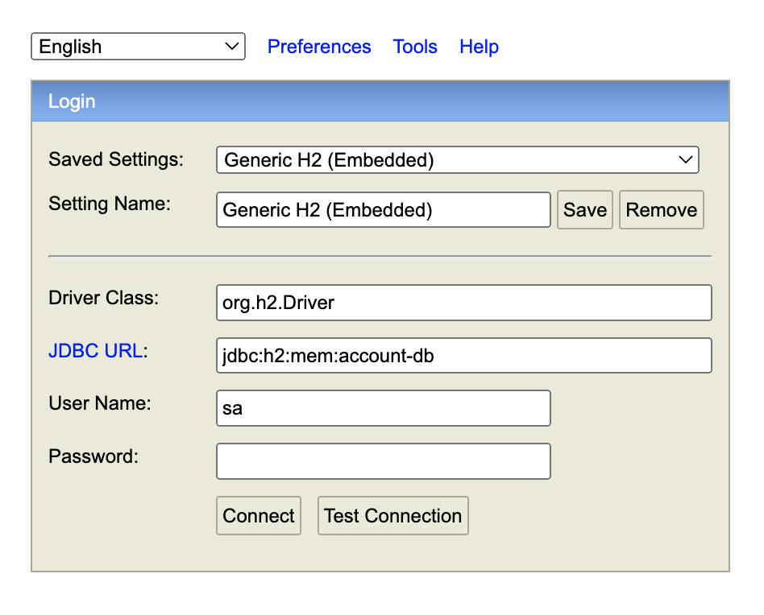
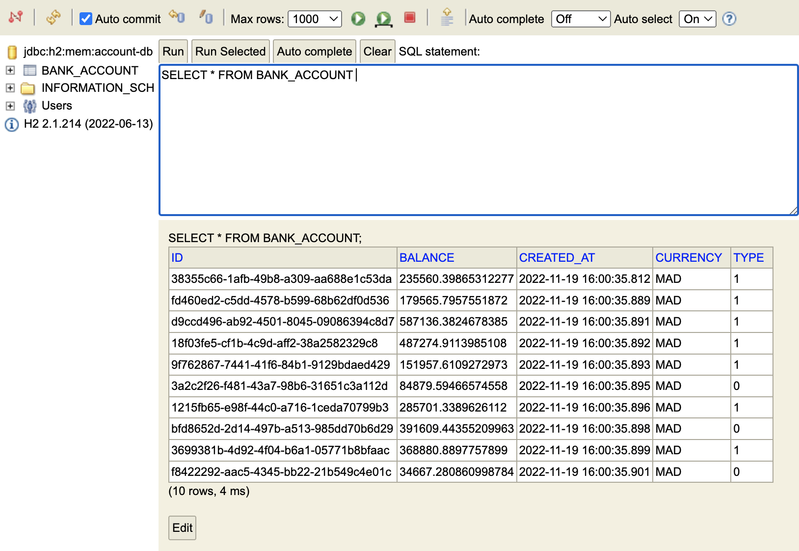

<h1>Développement d'un Micro-service avec les Web Services REST et GraphQL</h1>

 
<h3>Interfaces h2 database</h3>
 
<h5>Login</h5>

 
<h5>La base de données</h5>

 
<h3>Récupération des comptes existants</h3>

 
