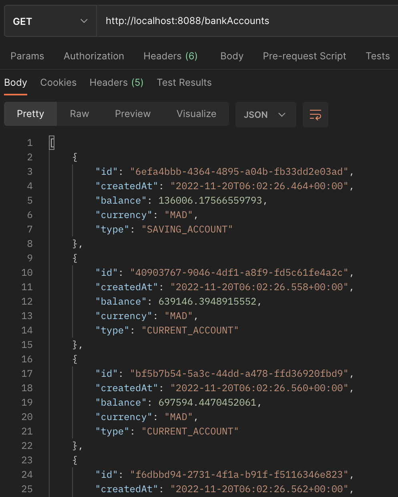

<h1>Développement d'un Micro-service avec les Web Services REST et GraphQL</h1>

 
<h3>Interfaces h2 database</h3>
 
<h5>Login</h5>

 
<h5>La base de données</h5>

 
<h3>Récupération des comptes existants</h3>

 
<h3>Récupération d'un compte existant</h3>
 
<h5>Url de récupération d'un compte</h5>

 
<h5>Résultat de la récupération du compte</h5>

 
<h3>Consommation du web service Rest avec Postman</h3>
 
<h5>Récupération des comptes existants</h5>

 
<h5>Récupération d'un compte existant</h5>

 
<h5>Création d'un compte avec Postman</h5>

 
<h5>Modification d'un compte existant avec Postman</h5>

 
<h5>Suppression d'un compte existant avec Postman</h5>

 
